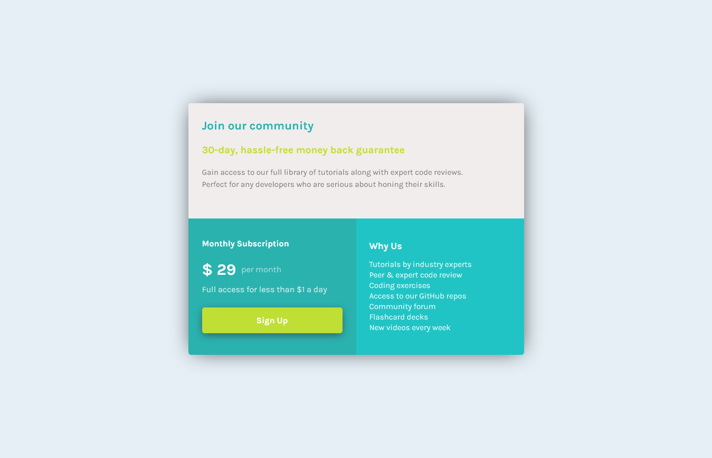

# Frontend Mentor - Single price grid component solution

This is a solution to the 
[Single price grid component challenge on Frontend Mentor](https://single-price-gridcomponent-main.netlify.app/). 

## Table of contents

- [Overview](#overview)
  - [The challenge](#the-challenge)
  - [Screenshot](#screenshot)
  - [Links](#links)
  - [Built with](#built-with)
- [Author](#author)

# Overview

## The challenge

Users should be able to:

- View the optimal layout for the component depending on their device's screen size
- See a hover state on desktop for the Sign Up call-to-action

## Screenshot

## Links

- Solution URL: [frontend](https://www.frontendmentor.io/solutions/single-price-grid-component-whit-html-and-css-H4D_t3m-9M)

## Built with

- HTML
- CSS
- Flexbox
- CSS Grid

## Author

- Website - [KreD](https://single-price-gridcomponent-main.netlify.app/)
- Frontend Mentor - [@DrGring](https://www.frontendmentor.io/profile/DrGring)
- Twitter - [@djahlin_e](https://www.twitter.com/djahlin_e)

